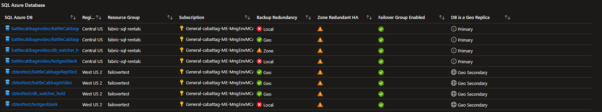
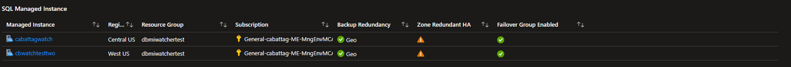
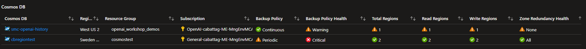

# Azure Database HA/DR Health Check

This workbook provides an overview of your Azure Data services, summarizing 
their High Availability and Disaster Recovery settings. 

Utilize the resulting information to make informed decisions on your data service
configurations that best align with your organizations SLA goals.

### Example Outputs

View the definitions page [here](/docs/definitions.md) for more details of the workbook output.

**Azure SQL Database**

**Azure SQL Managed Instance**

**Azure Cosmos DB**

## Deployment
Click the button below to deploy to your Azure Subscription:

